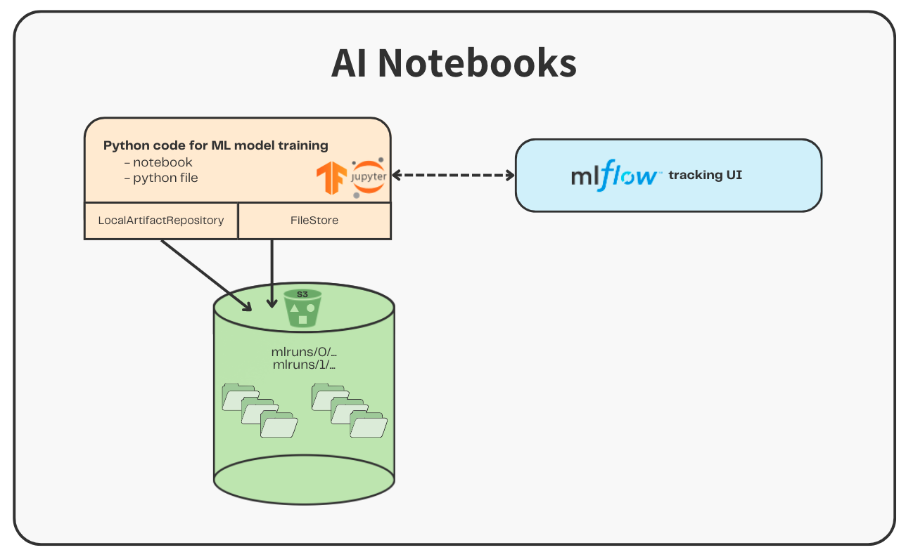

## Objective

The aim of this tutorial is to show you how to integrate [**MLflow**](https://mlflow.org/) inside AI Notebooks in order to track and compare your Machine Learning models.

**MLflow** is an open-source platform for *Machine Learning workflows management*. You can use this tool for ML model tracking, versioning but also storage and deployment.

- **How to use MLflow inside AI Notebooks?**

{.thumbnail}

For this purpose, we will compare **image classification** models: [EfficientNets](https://paperswithcode.com/method/efficientnet).

> [!primary]
>
> EfficientNet models are pre-trained on [ImageNet](https://www.image-net.org/) dataset.
>

In this context, several EfficientNet models will be trained on the same dataset: ([stanford_dogs](https://www.tensorflow.org/datasets/catalog/stanford_dogs#:~:text=The%20Stanford%20Dogs%20dataset%20contains,training%20and%208580%20for%20testing.)). The **Stanford Dogs** dataset contains images of 120 breeds of dogs from around the world.

The different models will be tracked and compared thanks to **MLflow** in order to be compare their performance:

- EfficientNet-b0
- EfficientNet-b1
- EfficientNet-b2
- EfficientNet-b3
- EfficientNet-b4
- EfficientNet-b5
- EfficientNet-b6
- EfficientNet-b7

## Requirements

- Access to the [OVHcloud Control Panel](https://ca.ovh.com/auth/?action=gotomanager&from=https://www.ovh.com/ca/en/&ovhSubsidiary=ca)
- An AI Notebooks project created inside a [Public Cloud project](https://www.ovhcloud.com/en-ca/public-cloud/) in your OVHcloud account
- A user for AI Notebooks

## Instructions

You can launch the notebook from the [OVHcloud Control Panel](https://ca.ovh.com/auth/?action=gotomanager&from=https://www.ovh.com/ca/en/&ovhSubsidiary=ca) or via the [ovhai CLI](/pages/public_cloud/ai_machine_learning/cli_11_howto_run_notebook_cli).

### Launching a Jupyter notebook with "TensorFlow" via UI (Control Panel)

To launch your notebook from the [OVHcloud Control Panel](https://ca.ovh.com/auth/?action=gotomanager&from=https://www.ovh.com/ca/en/&ovhSubsidiary=ca), refer to the following steps.

#### Code editor

Choose the `Jupyterlab` code editor.

#### Framework

In this tutorial, the `TensorFlow` framework is used. You can choose the `2.12` version: `tf2.12-py311-cudaDevel11.8`.

#### Resources

Using GPUs is recommended to train the **EfficientNet** models.

> [!primary]
>
> Here, using `1 GPU` is sufficient.
>

### Launching a Jupyter notebook with "TensorFlow" via CLI

*If you do not use our CLI yet, follow [this guide](/pages/public_cloud/ai_machine_learning/cli_10_howto_install_cli) to install it.*

To launch your notebook with the OVHcloud AI CLI, choose the `jupyterlab` editor and the `tensorflow` framework.

To access the different versions of `tensorflow` available, run the following command:

```console
ovhai capabilities framework get tensorflow -o yaml
```

> [!primary]
>
> Here, you can use the version `2.12` of TensorFlow (`tf2.12-py311-cudaDevel11.8`).
>

You will also need to choose the number of GPUs to use in your notebook, using `<nb-gpus>`.

To launch your notebook, run the following command:

```console
ovhai notebook run tensorflow jupyterlab \
		--name <notebook-name> \
		--framework-version tf2.12-py311-cudaDevel11.8 \
		--gpu <nb-gpus>

```

You can then reach your notebook’s URL once the notebook is running.

### Accessing the notebooks

Once our [AI examples repository](https://github.com/ovh/ai-training-examples/) has been cloned in your environment, find the fine-tuning notebook tutorial by following this path: `ai-training-examples` > `notebooks` > `go-further` > `mlflow` > `notebook-tutorial-mlflow-integration.ipynb`.

A preview of this notebook can be found on GitHub [here](https://github.com/ovh/ai-training-examples/blob/main/notebooks/go-further/mlflow/notebook-tutorial-mlflow-integration.ipynb).

## Go further

There are many other methods to track your ML model. Check our other tutorials to learn how to:

- [Use TensorBoard inside notebook](/pages/public_cloud/ai_machine_learning/notebook_tuto_02_tensorboard)

- [Weights & Biases integration](/pages/public_cloud/ai_machine_learning/notebook_tuto_03_weight_biases)

If you need training or technical assistance to implement our solutions, contact your sales representative or click on [this link](https://www.ovhcloud.com/en-ca/professional-services/) to get a quote and ask our Professional Services experts for a custom analysis of your project.

## Feedback

Please send us your questions, feedback and suggestions to improve the service:

- On the OVHcloud [Discord server](https://discord.com/invite/vXVurFfwe9)
