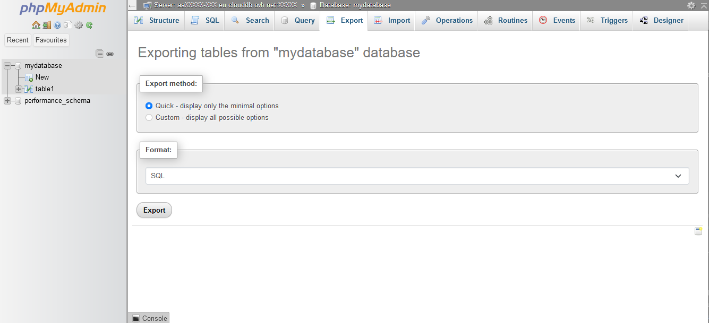

> [!primary]
> Tłumaczenie zostało wygenerowane automatycznie przez system naszego partnera SYSTRAN. W niektórych przypadkach mogą wystąpić nieprecyzyjne sformułowania, na przykład w tłumaczeniu nazw przycisków lub szczegółów technicznych. W przypadku jakichkolwiek wątpliwości zalecamy zapoznanie się z angielską/francuską wersją przewodnika. Jeśli chcesz przyczynić się do ulepszenia tłumaczenia, kliknij przycisk "Zgłóś propozycję modyfikacji" na tej stronie.
> 

## Wprowadzenie

Baza danych może zawierać dużą liczbę informacji niezbędnych dla Twojej strony WWW. Dlatego ważne jest, aby móc ją zapisać lub eksportować.

**Dowiedz się, jak tworzyć kopie zapasowe i eksportować bazę danych z serwera baz danych.**

## Wymagania początkowe

- Posiadanie [instancji Web Cloud Databases](https://www.ovhcloud.com/pl/web-cloud/databases/){.external} (zawartej w ofercie[hostingu www Performance](https://www.ovhcloud.com/pl/web-hosting/)
- Dostęp do [Panelu klienta OVHcloud](https://www.ovh.com/auth/?action=gotomanager&from=https://www.ovh.pl/&ovhSubsidiary=pl).

## W praktyce

> [!primary]
>
> Pamiętaj, że rozwiązania [Web Cloud Databases](https://www.ovh.pl/cloud/cloud-databases/){.external} nie dają dostępu do systemu zarządzania bazami danych, ale do baz danych na nim hostowanych.
> <br> - Pamiętaj, że nie ma dostępu "root".
> <br> - Ogólne polecenia SQL działają normalnie, a oprogramowanie takie jak HeidiSQL, SQuirreL lub Adminer jest w pełni kompatybilne.
>

### Tworzenie kopii zapasowych i eksportowanie bazy danych w Panelu klienta

Przejdź do Panelu [klienta OVHcloud](https://www.ovh.com/auth/?action=gotomanager&from=https://www.ovh.pl/&ovhSubsidiary=pl). Kliknij kartę `Web Cloud`, a następnie `Web Cloud Databases`{.action}. Wybierz nazwę serwera baz danych. Przejdź do karty `Bazy danych`.

W kolumnie **"Kopie zapasowe"** liczba ta odpowiada liczbie kopii zapasowych dostępnych dla Twojej bazy danych.

> [!primary]
>
> - Kopie zapasowe są wykonywane automatycznie raz dziennie
> na wszystkich Twoich bazach danych.
> - Automatyczne i ręczne kopie zapasowe są przechowywane przez 30 dni.
> Po tym czasie zostaną automatycznie usunięte.

#### 1\. Wykonywanie ręcznej kopii zapasowej 

Kliknij przycisk `...`{.action} po prawej stronie bazy danych, a następnie `Zapisz teraz`{.action}.

{.thumbnail}

#### 2\. Eksport kopii zapasowej

Kliknij przycisk `...`{.action} po prawej stronie bazy danych, a następnie `Wyświetl kopie zapasowe.`{.action}

{.thumbnail}

Pojawi się lista dostępnych kopii zapasowych, kliknij przycisk `...`{.action} po prawej stronie wybranej kopii zapasowej, a następnie `Pobierz kopię zapasową`{.action}, aby pobrać kopię zapasową.

### Tworzenie kopii zapasowych i eksportowanie bazy danych poza Panel klienta

#### 1\. Eksport bazy danych MySQL lub MariaDB

 W niektórych przypadkach pamięć RAM dostępna na serwerze baz danych nie pozwala na zrealizowanie pożądanego eksportu. W takim przypadku zalecamy użycie narzędzia OVHcloud w Panelu klienta. Dzięki temu będziesz mógł korzystać z zewnętrznych zasobów Twojej oferty do przeprowadzenia tej operacji. Przejdź do sekcji ["Tworzenie kopii zapasowych i eksportowanie bazy danych w Panelu klienta"](./#tworzenie-kopii-zapasowych-i-eksportowanie-bazy-danych-w-panelu-klienta) niniejszego przewodnika.

##### 1\.1 Eksportowanie bazy MySQL lub MariaDB z poziomu phpMyAdmin OVHcloud 

Aby zaimportować bazę danych bezpośrednio z phpMyAdmin, należy najpierw się do niej zalogować. Aby to zrobić, możesz zapoznać się z tym [przewodnikiem](/pages/web_cloud/web_cloud_databases/connecting-to-database-on-database-server).

Po zalogowaniu się do phpMyAdmin kliknij nazwę bazy danych, którą chcesz wyeksportować, a następnie zakładkę `Eksportuj`{.action} u góry.

Masz dwa możliwe sposoby eksportu. Jeśli nie potrzebujesz określonego trybu, zalecamy użycie trybu **szybkiego** w formacie **SQL**.

{.thumbnail}

##### 1\.2 Eksportowanie bazy MySQL lub MariaDB z wiersza poleceń

```bash
mysqldump --host=serveur --user=utilisateur --port=port --password=password nom_de_la_base > nom_de_la_base.sql
```

##### 1\.3 Eksport bazy MySQL lub MariaDB ze skryptu PHP

```php
1. <?php echo "Twoja baza jest w trakcie tworzenia kopii zapasowej.....";
2. system("mysqldump --host=serveur --user=utilisateur --port=port --password=password nom_de_la_base > nom_de_la_base.sql");
3. Echo "Koniec. Możesz pobrać bazę danych przez FTP";
4. ?>
```

> [!warning]
>
> - Aby zapobiec dostępowi strony trzeciej do tego pliku zawierającego dane wrażliwe, zapoznaj się z przewodnikiem dotyczącym bezpieczeństwa dostępu do tego pliku: ["Używanie .htaccess do ochrony hasła katalogu w serwisie WWW"](/pages/web_cloud/web_hosting/htaccess_protect_directory_by_password).
> - Operacja ta jest możliwa tylko z poziomu hostingu OVHcloud.
>

#### 2\. Eksport i import baz danych PostgreSQL poza Panelem klienta

 W niektórych przypadkach pamięć RAM dostępna na serwerze baz danych nie pozwala na zrealizowanie pożądanego eksportu. W takim przypadku zalecamy użycie narzędzia OVHcloud w Panelu klienta. Dzięki temu będziesz mógł korzystać z zewnętrznych zasobów Twojej oferty do przeprowadzenia tej operacji. Przejdź do sekcji ["Tworzenie kopii zapasowych i eksportowanie bazy danych w Panelu klienta"](./#tworzenie-kopii-zapasowych-i-eksportowanie-bazy-danych-w-panelu-klienta) niniejszego przewodnika.
 
##### 2\.1 Eksport bazy PostgreSQL z linii poleceń

```bash
pg_dump --host=serveur --port=port --user=utilisateur --password=password nom_de_la_base > nom_de_la_base.sql
```

##### 2\.2 Eksport bazy PostgreSQL ze skryptu PHP

```php
1. <?php echo "Twoja baza jest w trakcie tworzenia kopii zapasowej.....";
2. system("PGPASSWORD=mot_de_passe pg_dump --host=serveur --port=port --user=utilisateur --password=password nom_de_la_base > nom_de_la_base.sql");
3. Echo "Koniec. Możesz pobrać bazę danych przez FTP";
4. ?>
```

> [!warning]
>
> - Aby zapobiec dostępowi strony trzeciej do tego pliku zawierającego dane wrażliwe, zapoznaj się z przewodnikiem dotyczącym bezpieczeństwa dostępu do tego pliku: ["Używanie .htaccess do ochrony hasła katalogu w serwisie WWW"](/pages/web_cloud/web_hosting/htaccess_protect_directory_by_password).
> - Operacja ta jest możliwa tylko z poziomu hostingu OVHcloud.
>

## Sprawdź również

[Przywracanie i importowanie bazy danych na serwer baz danych](/pages/web_cloud/web_cloud_databases/restore-import-on-database-server)

W przypadku wyspecjalizowanych usług (pozycjonowanie, rozwój, etc.) skontaktuj się z [partnerami OVHcloud](https://partner.ovhcloud.com/pl/directory).

Jeśli chcesz otrzymywać wsparcie w zakresie konfiguracji i użytkowania Twoich rozwiązań OVHcloud, zapoznaj się z naszymi [ofertami pomocy](https://www.ovhcloud.com/pl/support-levels/).

Dołącz do społeczności naszych użytkowników na stronie <https://community.ovh.com/en/>. 